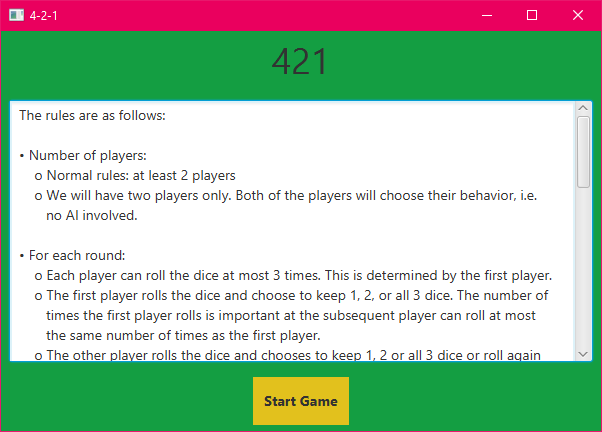
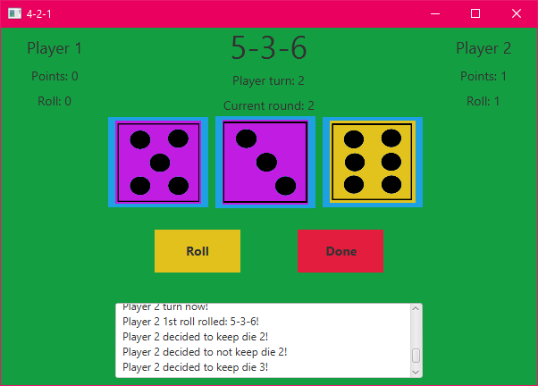

# 421 Dice Game

## Authors:
* Ruben Alvarez Reyes: rubenreyes@email.arizona.edu

* Javier Felix: jfelix2298@email.arizona.edu

## Description:
For the University of Arizona CSCV-335 spring 2020 capstone project

## Assets:

* [background_music.wav](asset/snd/background_music.wav)
    * license: CC BY 3.0
    * Author: [Jay_You](https://freesound.org/people/Jay_You/)
    * https://freesound.org/people/Jay_You/sounds/460432/

* [start_game.wav](asset/snd/start_game.wav)
    * license: sampling+
    * Author: [lukaso](https://freesound.org/people/lukaso/)
    * https://freesound.org/people/lukaso/sounds/69687/
    
* [roll_die.wav](asset/snd/roll_die.wav)
    * license: CC0 1.0
    * Author: [nettimato](https://freesound.org/people/nettimato/)
    * https://freesound.org/people/nettimato/sounds/353975/
    
* [switch_die.wav](asset/snd/switch_die.wav)
    * license: CC0 1.0
    * Author: [Magnesus](https://freesound.org/people/Magnesus/)
    * https://freesound.org/people/Magnesus/sounds/353828/

## Screenshots:
Start screen

Main screen

